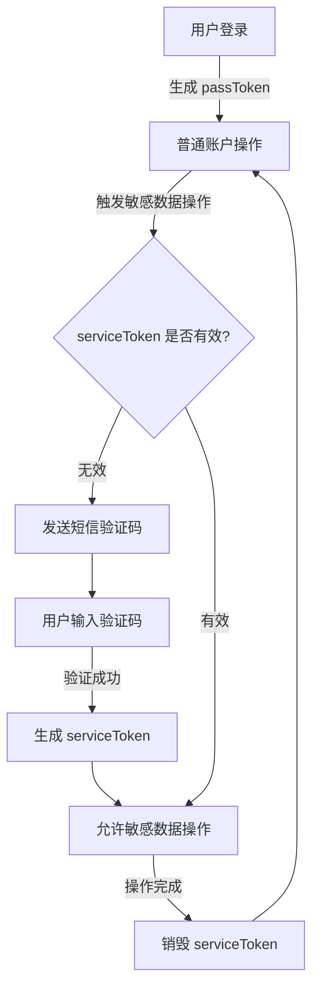

# 敏感操作二次验证设计方案

<!-- > 需求背景： 账号分享功能，但 **其他用户不能操作账号持有者的敏感信息**。 -->

<!-- 1. passToken：用于登录验证;
2. serviceToken：用于敏感信息操作的二次手机验证校验；

基本流程：
1）默认登录进来后，会生成 passToken（有效），可以进行基本账户操作；
2）serviceToken（默认无效），操作敏感数据时，需要手机短信二次验证，验证通过后，serviceToken 设置有效；
3）在 passToken 和 serviceToken 同时有效的情况下，用户可以操作敏感数据。

备注：
1）删除 passToken 或者手动修改 passToken，用户页面会被强制退出登录状态；
2）删除 serviceToken 或者手动修改 serviceToken，用户需要重新进行手机短信二次校验。 -->

## **1. 背景**

用户希望在游戏账号分享的情况下，确保他人无法篡改或售卖账号的敏感信息。为此设计了一套基于两类 Token 的验证机制：

1. **passToken**：用于登录验证。
2. **serviceToken**：用于敏感信息操作的二次手机验证校验。

## **2. 基本流程**

1. **passToken**

   - 用户登录后生成 `passToken`，可进行基本账户操作。

2. **serviceToken**

   - 初始状态下 `serviceToken` 无效。
   - 用户尝试操作敏感信息时，触发手机短信验证。
   - 验证通过后生成 `serviceToken`，允许敏感操作。

3. 在 `passToken` 和 `serviceToken` 同时有效的情况下，用户可操作敏感数据。

4. **异常处理**：
   - 删除 `passToken` 或手动篡改后，强制用户退出登录。
   - 删除 `serviceToken` 或手动篡改后，用户需重新进行二次验证。

## **3. 流程图**



## **4. 详细设计**

### **1. passToken（登录验证 Token）**

- **生成**：

  - 用户登录时生成，返回客户端并存储于服务端（如 Redis）。
  - 有效期通常设置为 1 天至 7 天。

- **验证**：

  - 每次 API 调用时，校验 `passToken` 是否有效。

- **销毁**：
  - 用户主动登出或检测到异常行为（如多次密码错误）。

### **2. serviceToken（二次验证 Token）**

- **触发**：

  - 用户尝试敏感操作时，服务端检测到 `serviceToken` 无效，触发短信验证。

- **生成流程**：

  1. 服务端生成随机验证码（如 6 位数字）。
  2. 缓存验证码（有效期 5 分钟）并发送至用户绑定手机号。
  3. 用户提交验证码后，生成短时效的 `serviceToken`。

- **验证与销毁**：
  - 每次敏感操作需携带 `serviceToken`，服务端校验其有效性。
  - 操作完成后，`serviceToken` 立即失效。

### **接口设计**

#### **1. 登录接口**

- **Request**:

  ```http
  POST /auth/login
  Content-Type: application/json

  {
      "username": "user123",
      "password": "securePassword"
  }
  ```

- **Response**:
  ```json
  {
    "passToken": "eyJhbGciOiJIUzI1NiIsIn...",
    "expiresIn": 86400
  }
  ```

#### **2. 敏感操作验证接口**

- **Request**:

  ```http
  POST /auth/request-service-token
  Content-Type: application/json

  {
      "operation": "modify_password"
  }
  ```

- **Response**:
  ```json
  {
    "message": "Verification code sent"
  }
  ```

#### **3. 验证短信接口**

- **Request**:

  ```http
  POST /auth/verify-sms
  Content-Type: application/json

  {
      "code": "123456",
      "operation": "modify_password"
  }
  ```

- **Response**:
  ```json
  {
    "serviceToken": "eyJhbGciOiJIUzI1NiIsIn...",
    "expiresIn": 300
  }
  ```

#### **4. 敏感操作接口**

- **Request**:

  ```http
  POST /user/modify-password
  Authorization: Bearer passToken
  X-Service-Token: serviceToken

  {
      "newPassword": "newSecurePassword"
  }
  ```

- **Response**:
  ```json
  {
    "message": "Password updated successfully"
  }
  ```

## **5. 安全措施**

1. **验证码防刷**：

   - 限制手机号发送频率（如每分钟 1 次）。
   - 使用图片验证码防止机器人滥用。

2. **Token 防篡改**：

   - 使用 JWT 签名机制，确保 Token 内容无法被篡改。
   - 强制使用 HTTPS 传输，防止中间人攻击。

3. **Token 限制**：

   - `passToken` 绑定用户设备（如通过 IP 或 User-Agent 校验）。
   - `serviceToken` 绑定具体操作类型，短时效性（如 5 分钟）。

4. **日志记录**：
   - 记录每次敏感操作的验证过程及结果，便于追踪潜在安全风险。

## **6. 前端配合**

#### **页面逻辑**

1. 登录成功后，存储 `passToken`（如 HttpOnly Cookie）。
2. 进入敏感操作页面时：
   - 检查 `serviceToken` 是否有效。
   - 无效时弹出短信验证框，调用 `/auth/request-service-token` 发送验证码。
   - 用户输入验证码后，调用 `/auth/verify-sms` 获取 `serviceToken`。

#### **伪代码（示例）**

```javascript
async function sensitiveAction(actionUrl, payload) {
  const serviceToken = localStorage.getItem("serviceToken");
  if (!serviceToken) {
    const verified = await requestServiceToken(); // 验证短信
    if (!verified) {
      alert("短信验证未通过");
      return;
    }
  }
  // 发起敏感操作请求
  const response = await fetch(actionUrl, {
    method: "POST",
    headers: {
      Authorization: `Bearer ${getPassToken()}`,
      "X-Service-Token": serviceToken,
      "Content-Type": "application/json",
    },
    body: JSON.stringify(payload),
  });
  if (response.status === 403) {
    alert("Service Token 已失效，请重新验证");
    localStorage.removeItem("serviceToken");
  }
}
```

## **7. 总结**

- **passToken**：负责登录验证，维持用户会话。
- **serviceToken**：专注敏感操作验证，确保账户安全。
- 严格的验证逻辑与安全措施能有效保障敏感信息安全，同时兼顾用户体验。

## **8. 页面 UI 截图**

> A[用户登录] -->|生成 passToken| B[普通账户操作]


> B -->|触发敏感数据操作| `C{serviceToken 是否有效?}`


> C -->|无效| D[发送短信验证码]<br/>
> D --> E[用户输入验证码]


> E -->|验证成功| F[生成 serviceToken]<br/>
> F --> G[允许敏感数据操作]<br/>
> C -->|有效| G


